# DealTrace

> **DealTrace - AI-powered deal health scoring inside Outlook**

## Demo Page

> https://deal-trace-gse.vercel.app

## Primary Application

**Microsoft Outlook** (Office Add-in / Taskpane)

## The Problem

Every deal is different. Different prospect, different timing, different competitive pressure. But the one constant across every deal an SE has ever worked is the SE themselves.

And with every deal, a pattern has been building. How they respond when a competitor gets mentioned. How long they wait before following up. Whether they push for next steps or let the thread breathe. These micro-behaviors repeat across hundreds of threads, quietly accumulating into habits that either close deals or cost them.
But patterns are only useful when they are visible. Research shows that humans have a bias blind spot. We see patterns all around us, but rarely in ourselves. [[Sage Journals]](https://journals.sagepub.com/doi/10.1177/09637214231178745) An SE can work a hundred deals and never clearly see which of their own habits are driving wins and which ones are quietly working against them. The signal is there, buried across every thread they have ever sent, but there is no structure to surface it.

Won deals and lost deals sit in the same inbox, never compared. The habits behind a breakthrough quarter go unexamined. The early divergence between a deal that closed and one that did not stays invisible until after it matters.
The pattern exists. It has always existed. It just has nowhere to live.

## How AI Was Used

AI was used at every stage of this project, from the brainstorming phase where ideas were explored and refined into a finalized concept, to the implementation where it drives the core product experience. DealTrace isn't a wrapper around a chatbot. AI is embedded directly into the workflow.

**Thread analysis (per-message tagging):** Every message in the email thread is passed to the LLM with a detailed system prompt that instructs it to identify behavioral signals, who said what, whether it's from the prospect or the seller, and what it means for the deal. The model returns structured JSON: per-message tags with signal, confidence, category, and direction.

**Deal scoring:** A second LLM call takes the full tagged thread plus a library of historical won/lost/stalled deal patterns and computes a health score from 0-100. The scoring prompt encodes explicit rules, including terminal conditions (clear rejection forces the score below 25, signed contract forces it above 80), recency weighting (last 2 messages count 3x more), and compound penalties for pricing objections combined with competitor mentions.

**Pattern library context:** Before scoring, the app injects a library of behavioral patterns extracted from real historical deals (won, lost, stalled) into the scoring prompt. The model can compare the current thread against what closing and losing actually looked like in practice.

**Draft email generation:** The scoring response includes a short, contextual follow-up email written in the seller's voice, with different tone and call to action depending on whether the deal is healthy, at risk, or lost.

**Playbook and case study generation:** Beyond live deal analysis, the app uses AI to generate two types of reports exported as PowerPoint presentations. The Rep Playbook aggregates patterns across all historical deal threads, identifying what behaviors correlated with wins versus losses and translating those into concrete recommendations. The Individual Case Study takes a single deal thread and produces a structured narrative: what happened, the key turning points, why the deal was won or lost, and what the rep could do differently next time.

**Cursor (development):** Cursor was used as a coding collaborator throughout the build, writing prompts, iterating on schema design, implementing Graph API integration, and reviewing scoring logic edge cases.

## What Was Built

DealTrace is a Microsoft Outlook add-in that lives in the taskpane and analyzes the currently open email conversation in real time.

It reads the full email thread via Microsoft Graph, then uses an LLM to:

- **Tag each message** with behavioral signals (engagement level, urgency, sentiment, and intent) labeled by direction (positive / negative / neutral) and confidence score
- **Score the deal** from 0-100 based on a won/loss divergence model, weighted by recency and signal strength
- **Predict deal health**: on track, at risk, or critical
- **Surface win factors and risk factors** grounded in actual prospect language from the thread
- **Generate specific, actionable next-step recommendations** for the rep
- **Draft a follow-up email** tailored to the current deal state
- **Generate Rep Playbook** analyzes the full history of past deal threads, surfaces win/loss patterns, and produces actionable recommendations for improving future deals
- **Generate Individual Case Study** produces a structured case study from a single historical deal thread, capturing what happened, why it won or lost, and what to do differently

It also draws on a library of historical won/lost/stalled deal patterns extracted from our own email threads and case studies. This grounds the scoring in real outcomes, so the model isn't analyzing the current thread in isolation but comparing it against what winning and losing actually looked like.

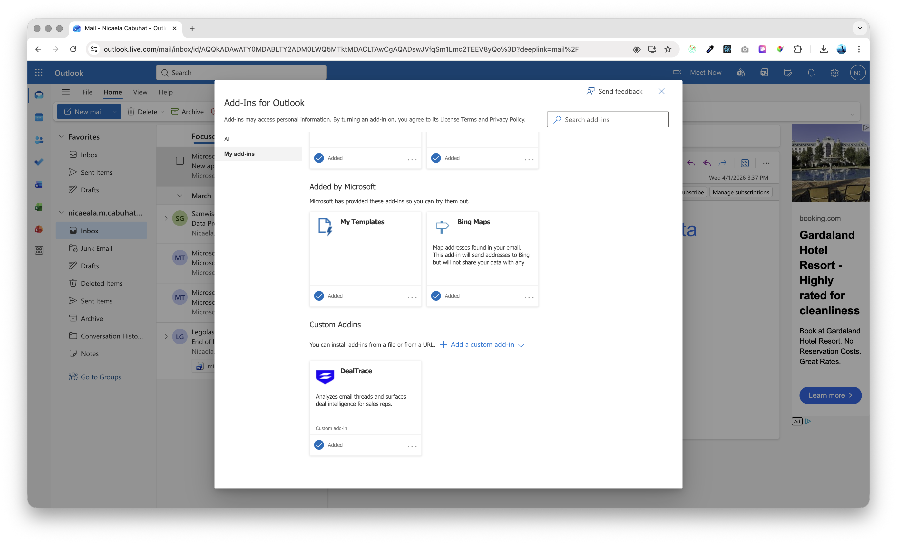
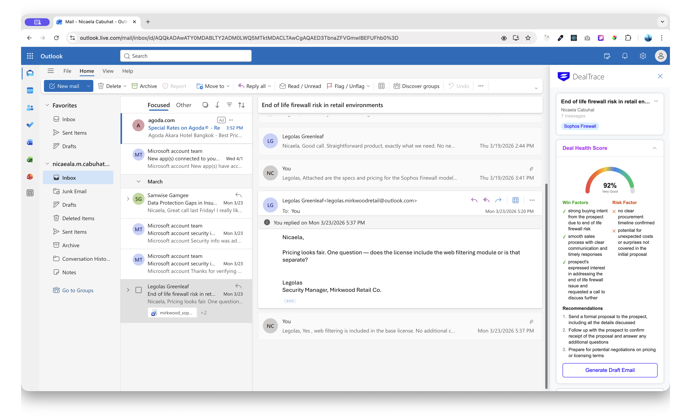
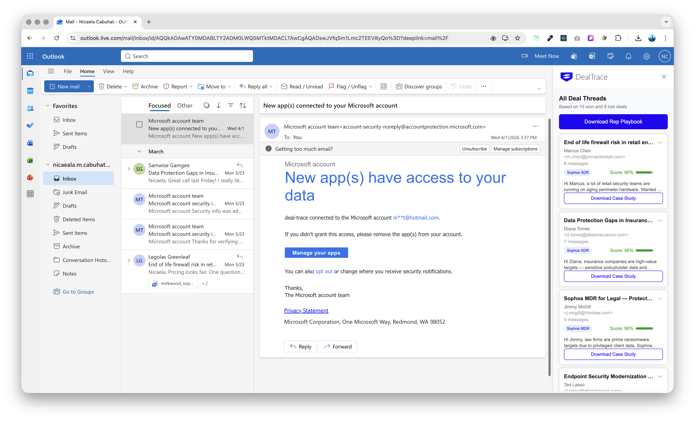
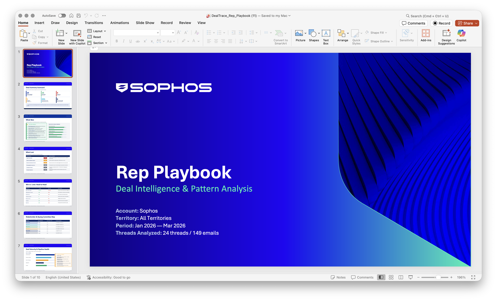
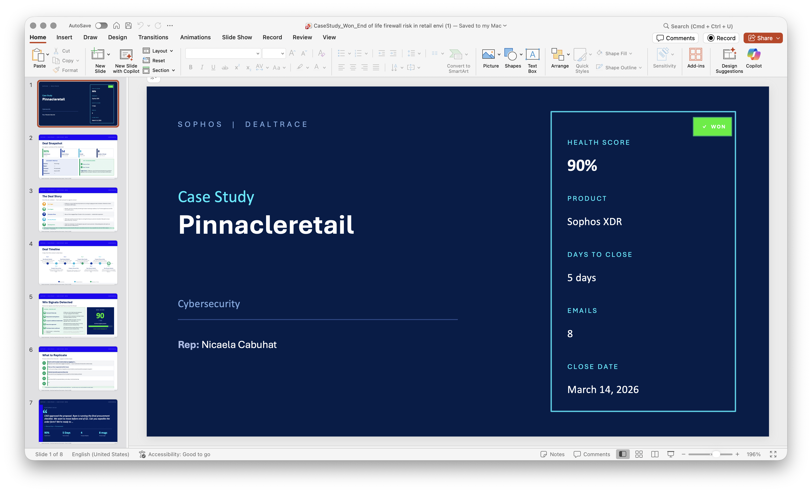
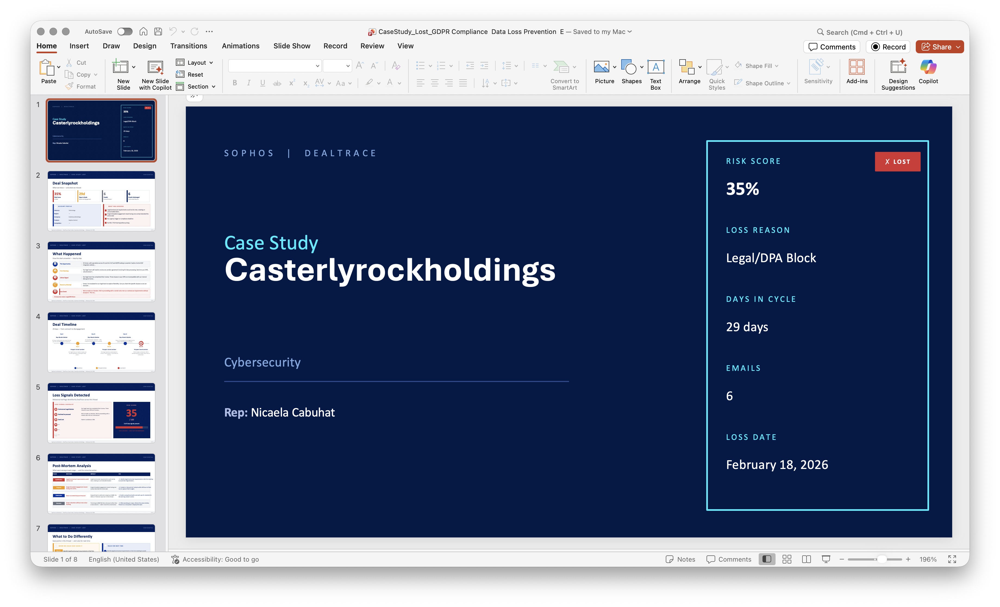
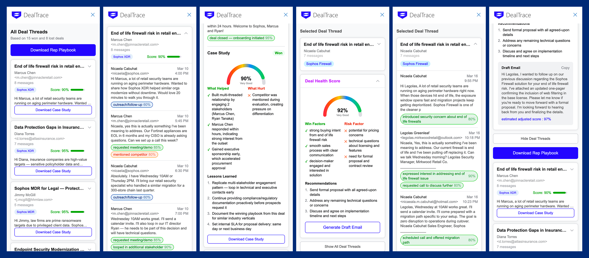

## What I Learned

At the start, I had no clear direction. So I did what I know how to do, I audited myself. I asked what I'm actually good at, what I build every day, and who I build it for. The answer was straightforward. I've been building utility tools for Sales Engineers. Outlook is the one application we both use. So that's where I focused on, build something meaningful for a tool SEs already use, rather than chasing something impressive I didn't understand yet.

What I didn't expect was the confidence that came with it. I would never have attempted to build an Outlook add-in before this challenge. The idea alone would have stopped me. But once I started, broke it down, and got it working, something shifted. The number of things I now believe I can build has genuinely expanded.
I was also deliberate about how I used AI throughout. Working with limited tokens forced me to plan before I prompted. I thought through my workflow first, identified exactly what I needed help with, and used AI as a precision tool rather than a crutch. That discipline made the whole process sharper.

This challenge didn't just produce a project. It changed what I think is possible.

## Value Created

**For Sales Engineers:** Every deal adds to a personal knowledge base they never had to manually build. Over time, DealTrace surfaces strategies and habits the SE was already running but never had visibility into. Skill compounds because history compounds. The more deals, the sharper the pattern. The sharper the pattern, the better the next deal. And when a deal is active, the health score is not just a diagnostic. It is an asset. A scored, explained read on where the deal stands gives the SE the confidence and clarity to act at exactly the right moment.

**For customers:** Every touchpoint from an SE using DealTrace is grounded in what the thread actually said. No retreading covered ground, no generic follow-ups, no outreach that arrives at the wrong moment. The prospect gets an SE who already knows where the conversation stands and responds to exactly that, nothing more, nothing less.

## Tools Used

- **Groq** (LLM inference) - `llama-3.3-70b-versatile` for thread analysis and scoring
- **Next.js App Router** - server-side API routes for all AI calls (no LLM calls from the client)
- **Microsoft Graph API** - reads the live Outlook conversation from the signed-in user's mailbox
- **MSAL (Microsoft Authentication Library)** - SSO via Azure AD for secure, scoped mailbox access
- **Cursor** - used throughout development for implementation, iteration, and code review

## Tech Stack

| Layer         | Technology                             |
| ------------- | -------------------------------------- |
| Framework     | Next.js 16 (App Router)                |
| Language      | TypeScript (strict mode)               |
| Add-in Host   | Microsoft Outlook (Office.js taskpane) |
| Auth          | MSAL + Azure AD (SSO)                  |
| Graph         | Microsoft Graph API v1.0               |
| AI Inference  | Groq SDK (`llama-3.3-70b-versatile`)   |
| Validation    | Zod                                    |
| State         | Zustand + TanStack React Query         |
| Styling       | Tailwind CSS                           |
| UI Primitives | Radix UI                               |

## Running Locally

```bash
# Install dependencies
npm install

# Start the development server
npm run dev
# or
./dev.sh
```

Open [http://localhost:3000](http://localhost:3000) - the taskpane loads at `/taskpane`.

## Open Add-in on Outlook

Run on project root directory

```bash
./public/gen-manifest.sh https://deal-trace-gse.vercel.app/`
```

Open Enhance Outlook with apps
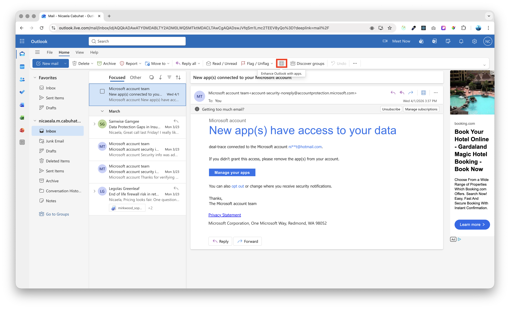

Add a custom add-in
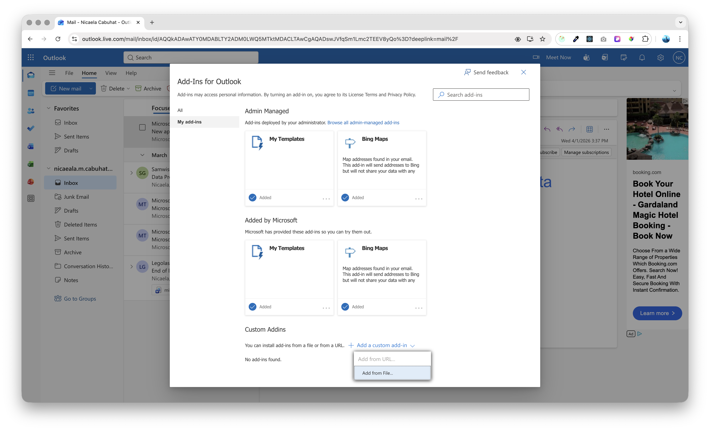

Select `manifest.xml` from public folder
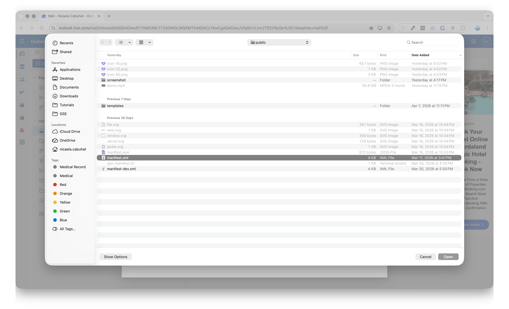

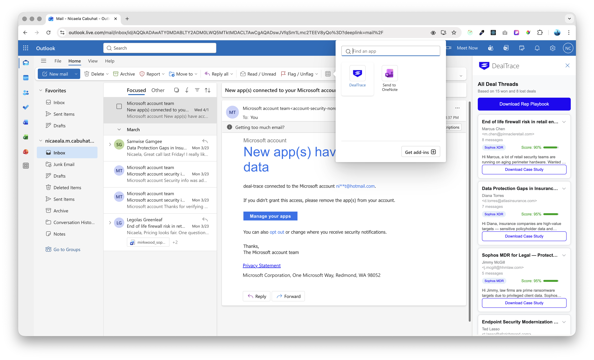

### Environment Variables

```env
GROQ_API_KEY=
AZURE_AD_CLIENT_ID=
AZURE_AD_CLIENT_SECRET=
AZURE_AD_TENANT_ID=
NEXTAUTH_SECRET=
NEXTAUTH_URL=
```

## Project Structure

```
src/
  app/
    api/
      analyze/     # LLM thread tagging endpoint
      score/       # Deal health scoring endpoint
      playbook/    # Pattern library + case study context
      graph/       # Microsoft Graph proxy routes
    taskpane/      # Outlook add-in entry point
    sample/        # Main deal analysis UI
  lib/
    deal/          # Pattern library, win/loss classification
    graph/         # Graph client, thread grouping
    groq/          # Groq client
    outlook/       # Office.js mailbox hooks
    queries/       # TanStack Query hooks (analyze, score, thread)
    schemas/       # Zod schemas for all API boundaries
  components/
    playbook/      # ThreadList, ThreadScore, TagBadge UI
```
